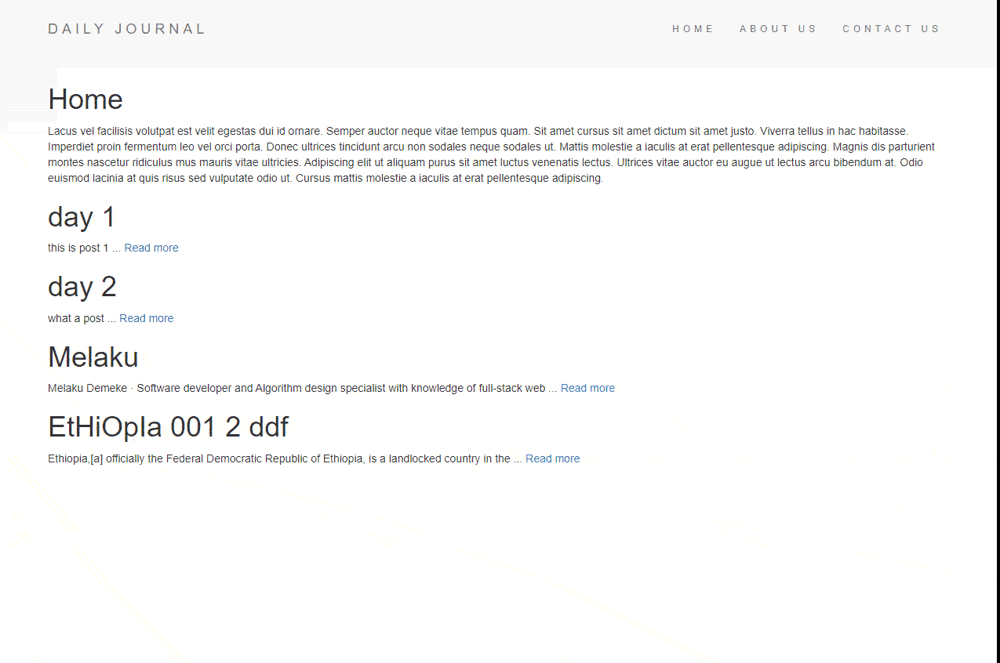

# Blog-web

<h3 align="left">Languages and Tools:</h3>
<p align="left">  </a> <a href="https://www.w3schools.com/css/" target="_blank" rel="noreferrer">  </a> <a href="https://www.w3.org/html/" target="_blank" rel="noreferrer">  </a> <a href="https://developer.mozilla.org/en-US/docs/Web/JavaScript" target="_blank" rel="noreferrer">  </a> <a></a></p>


This is a simple frontend project which is built while learning full-stack web development by Dr.Angela yu the course is called  [The Complete 2022 Web Development Bootcamp](https://www.udemy.com/course/the-complete-web-development-bootcamp/) this is the best-seller course in web development on Udemy

## installaion 
```
npm install
```

## Result of the code


## what i learn
1. node
2. express
3. ejs
4. templating in ejs
5. rendering dynamic pages
